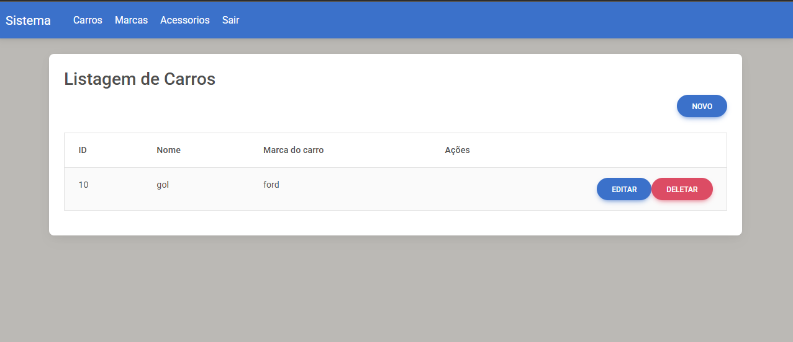
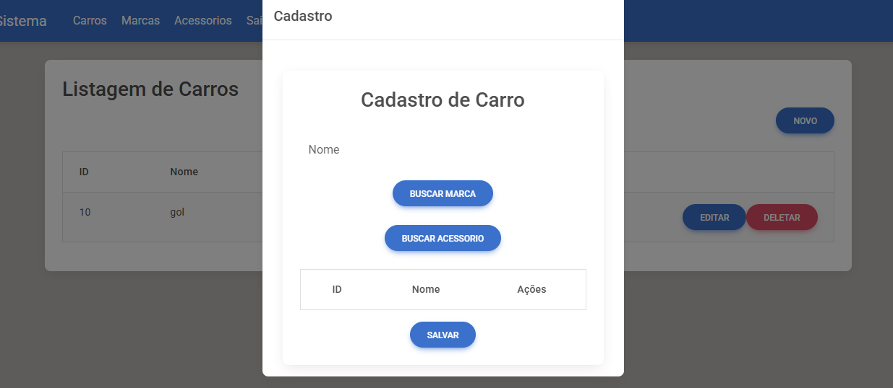

# 🚗 Projeto de Gerenciamento de Carros, Marcas e Acessórios

Este projeto consiste em uma aplicação web Full-Stack desenvolvida em Angular no fron-tend e Spring Boot no back-end(vale ressaltar que esse é o projeto front, para vê-lo funcionar deve baixar e rodar a versão do back-end). A aplicação realiza operações CRUD completas para entidades de Carros, Marcas e Acessórios, com relacionamento entre elas.


## 🛠 Tecnologias Utilizadas

### Backend (Spring Boot)
- Java 17+

- Spring Boot

- Spring Data JPA

- Spring Web

- MySQL

### Frontend (Angular)
- Angular 17+

- TypeScript

- Angular Material

- RxJS

- BootStrap


## 🔗 Relacionamentos Entre Entidades

### Carro
- Possui uma única Marca (Relacionamento: muitos para um)
- Pode ter vários Acessórios (Relacionamento: muitos para muitos)

### Marca
- Pode estar associada a vários Carros (Relacionamento: um para muitos)

### Acessório
- Pode estar associado a vários Carros (Relacionamento: muitos para muitos)


## 🚀 Funcionalidades
 ✅Cadastro, listagem, edição e exclusão de Carros

 ✅Cadastro, listagem, edição, exclusão e gerenciamento de Marcas

 ✅Cadastro, listagem, edição ,exclusão e associação de Acessórios

 ✅Integração entre frontend e backend via API REST

 ✅Validações de formulário


## 🔧 Como Rodar o Projeto

### Frontend (Angular)
1. Clone o repositório.

2. Vá para a pasta do frontend:
``` bash
cd app-carro-angular-front
```

3. Instale as dependências:
``` bash
npm install
```

4. Inicie a aplicação Angular:
``` bash
ng serve
```


## 🖼️ Capturas de Tela






## 📌 Observações

- Este projeto está com a url do banco de dados MySQL no arquivo do back src/main/resources/application.properties;

- Crie uma base de dados chamada (carros), para que ao rodar a versão do back, as tabelas sejam criadas dentro do schema;

- O projeto possui uma tela de login, onde o nome do Usuario é (admin) e a senha (admin);

- Projeto ideal para fins didáticos, portfólios ou bases para sistemas automotivos maiores;


## Licença
Curso do projeto disponibilizado e ensinado no canal de youtube do professor Welligton de Oliveira.

-[Youtube - Welligton Oliveira] (https://www.youtube.com/@wellfoz)

